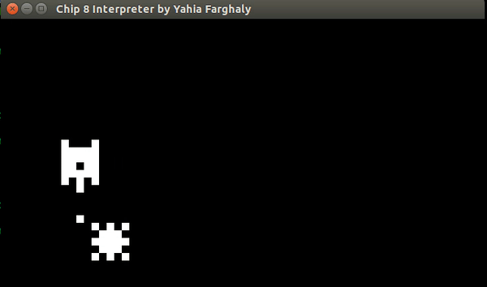
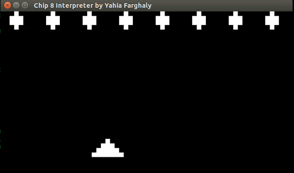
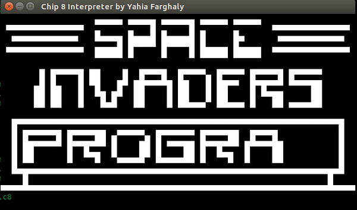

# CHIP-8-Interpreter

CHIP-8 is an interpretted programming language developed by Joseph Weisbecker in
n the late 1970s and early 1980s and was initally used on the COSMAC VIP and
Telmac 1800 8-bit microcomputers to make game programming easier.

CHIP-8 programs are run using a CHIP-8 virtual machine (Interpreter).

This repository contains a full implementation of a CHIP-8 Interpreter.

## Games Examples used with this interpreter

### Tank Game

### Missle Game

### Space Invaders

## References

[Cowgod's Chip-8 Technical Reference v1.0](http://devernay.free.fr/hacks/chip8/C8TECH10.HTM#2.5)
[Mastering CHIP-8 by Matthew Mikolay](http://mattmik.com/files/chip8/mastering/chip8.html)
